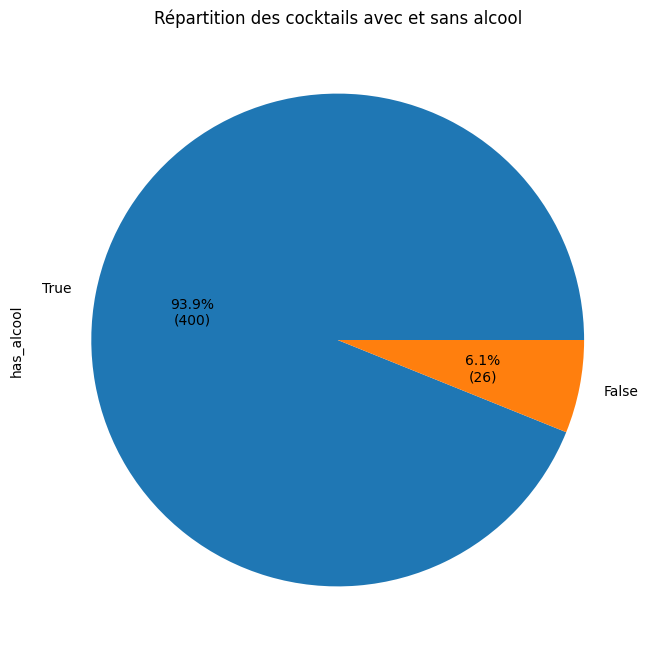
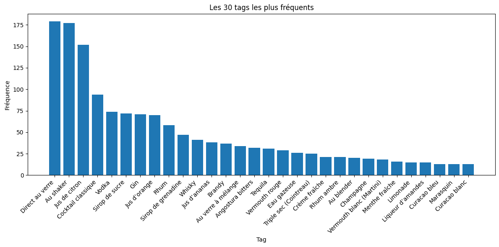
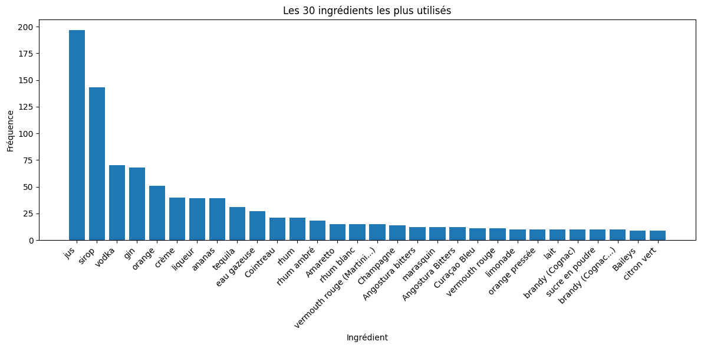
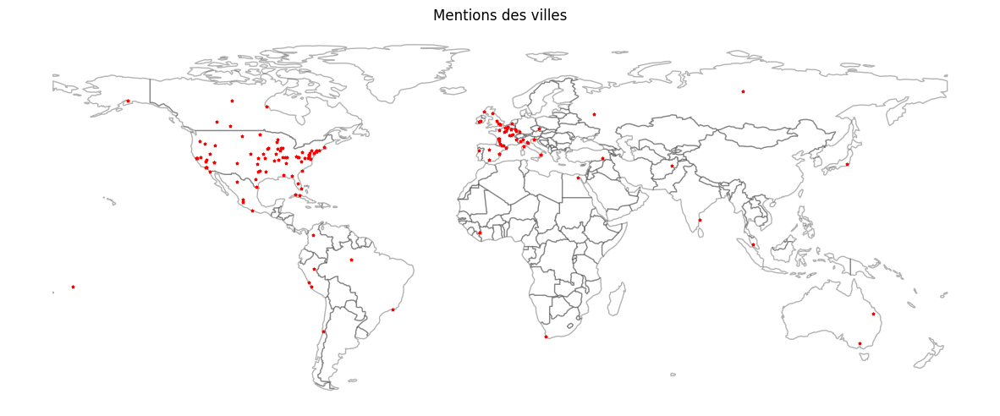
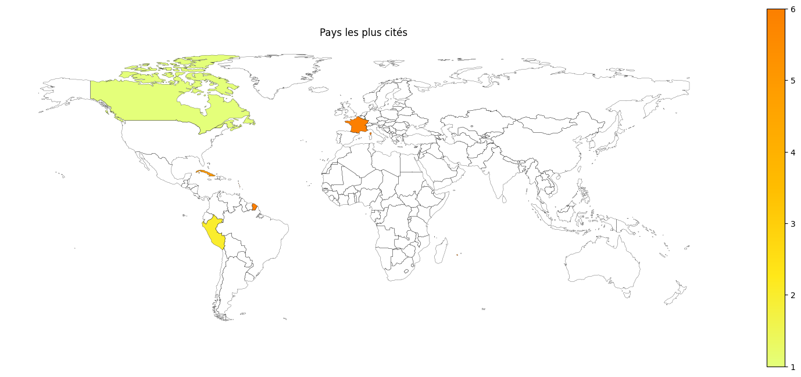
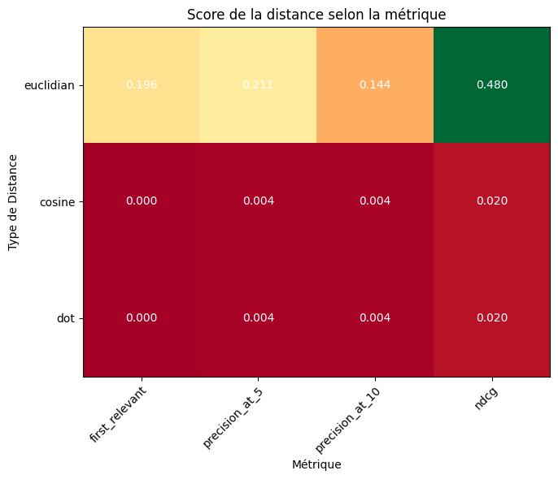
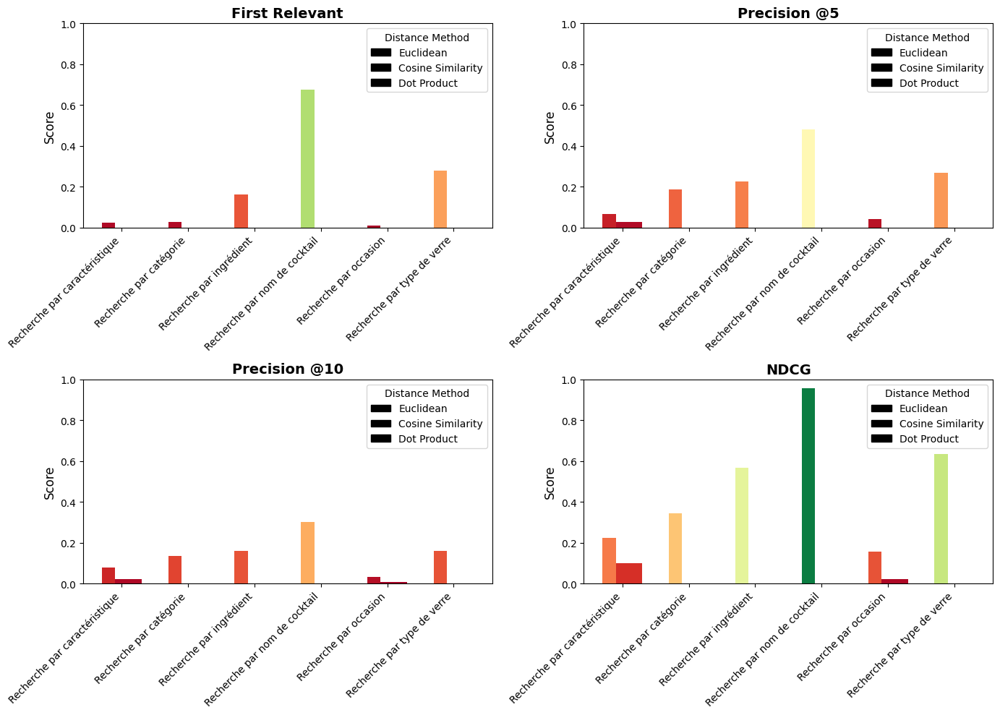
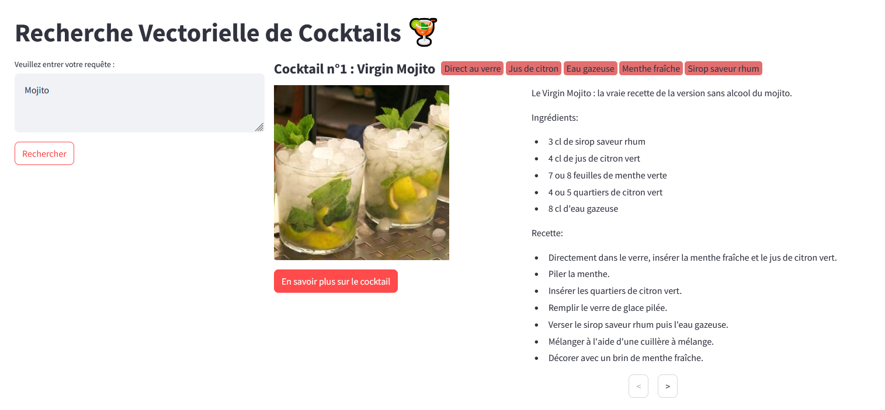

# Projet Cocktail RAG

## Introduction

Le projet Cocktail RAG consiste à retrouver un cocktail à partir d'un texte entré quelconque grâce à une base de données vectorielle.

Ce projet a été organisé en 5 étapes :

1. Récupération des données de cocktails
2. Exploration des données avec visualisations
3. Création de la base de données vectorielle
4. Création du dataset d'évaluation pour les méthodes de recherche
5. Comparaison des méthodes de recherche de distance

Avec en bonus la réalisation d'une application Streamlit

# Plan du compte rendu :

1. [Web Scrapping](#web-scrapping)
2. [Exploration Data](#exploration-data)
3. [Création BD Vectorielle](#creation-bd-vectorielle)
4. [Dataset Evaluation](#dataset-evaluation)
5. [Benchmark Distance](#benchmark-distance)
6. [Application Streamlit](#application-streamlit)
7. [Conclusion](#conclusion)

## 1. Web Scrapping

Premièrement, nous devons récupérer un jeu de données de cocktails, et pour cela j'ai utilisé le site [cocktailmag](https://www.cocktailmag.fr/) qui offre une liste de cocktails assez exhaustive ainsi qu'une page détaillée pour chaque cocktail.

Ainsi, avec la librairie `BeautifulSoup` pour faire du webscrapping, j'ai pu récupérer les données suivantes pour **426 cocktails** :

- Nom du cocktail
- Image du cocktail (lien)
- Description courte
- Caractéristiques
- Ingrédients
- Recette
- A propos

Toutes ces données sont stockées dans un fichier `cocktails.csv`.

## 2. Exploration Data

Avant de créer la base de données vectorielle, il est important d'explorer les données pour comprendre ce que l'on a récupéré.

Pour cela, j'ai utilisé la librairie `matplotlib` pour réaliser des visualisations sur les données récupérées.

Présence de cocktails avec ou sans alcool :

    

Présence des tags (top 30) :

    

Présence des ingrédients (top 30) :

    

Citation de villes :

    

Citation de pays :

    

## 3. Création BD Vectorielle

Désormais que nous avons exploré les données, nous allons créer une base de données vectorielle.

Afin de générer un vecteur pour chaque cocktail, j'ai utilisé la librairie `sentence-transformers` et le modèle `all-MiniLM-L6-v2` qui permet de transformer un texte en vecteur.

Mais ayant plusieurs colonnes de texte pour chaque cocktail, j'ai décidé de concaténer les colonnes suivantes :

- Description courte (qui contient forcément le nom du cocktail)
- Tags
- Ingrédients
- A propos

Une fois ces colonnes concaténées, j'ai pu générer un vecteur pour chaque cocktail que j'ai stocké dans une base de donnée SQLite.

## 4. Dataset Evaluation

Afin de tester les méthodes de recherche de distance, j'ai voulu créér un dataset d'évaluation.

Pour cela, je me suis inspiré d'une méthode *LLM-as-a-judge* qui consiste à poser des questions à un modèle de langage pour qu'il juge la similarité entre deux textes.

J'ai identifié 6 catégories de recherches qui pourraient être intéressantes pour un utilisateur cherchant un cocktail :

- **Recherche par nom de cocktail** : "Quelle est la recette du cocktail Margarita ?"
- **Recherche par ingrédient** : "Quels cocktails puis-je faire avec du rhum et du citron ?"
- **Recherche par catégorie** : "Quel cocktail je pourrais faire sans alcool ?" 
- **Recherche par type de verre** : "Quels cocktails puis-je faire avec un verre à Martini ?"
- **Recherche par caractéristique** : "Je cherche un cocktail rafraichissant pour l'été"
- **Recherche par occasion** : "Quels cocktails puis-je faire pour une soirée entre amis ?"

Pour chaque question, j'ai demandé au langage de modèle `Mistral Large 2411` de générer 10 questions par catégorie. Et enfin pour les 6 catégories x 10 questions par catégorie = 60 questions j'ai demandé à nouveau au LLM de trouver les 10 cocktails les plus pertinents par rapport à la question (le LLM ayant en contexte la liste des 426 cocktails).

Ainsi j'ai pu générer un dataset d'évaluation `cocktails_questions_eval.csv`.

## 5. Benchmark Distance

Maintenant que nous avons notre dataset d'évaluation, nous allons pouvoir tester les méthodes de recherche de distance suivantes :

- Distance Euclidienne
- Cosine Similarity
- Dot Product

Il nous faut également des métriques d'évaluation pour déterminer a quel point la distance répond juste ou nom, et pour cela j'ai séléctionné 4 méthodes :

- Precision at k (P@K) : proportion des éléments pertinents parmi les k premiers éléments de la liste de recommandation. Il y aura ici deux métriques P@K : P@5 et P@10.
- First relevant : position du premier élément pertinent dans la liste de recommandation.
- NDCG (Normalized Discounted Cumulative Gain) : mesure de la pertinence des éléments recommandés. (voir plus d'information [ici](https://en.wikipedia.org/wiki/Discounted_cumulative_gain))

Ainsi, j'ai pu comparer les 3 méthodes de recherche de distance sur les 60 questions du dataset d'évaluation, et voici les résultats avec plusieurs graphiques :

    

Sur ce premier graphique on observe que la distance euclidienne obtient de bien meilleurs scores que les deux autres distances.

Nous pouvons regarder de plus près par catégorie et par métrique le résultat de chaque méthode de calcul de distance :

    

Ici le graphique confirme les résultats précédents, la distance euclidienne est la meilleure méthode de calcul de distance.

De plus on peut observer que dans la distance euclidienne se débrouille particulièrement bien dans la catégorie "Recherche par nom de cocktail" ce qui est logique car le nom du cocktail est dans la description courte, ce qui aide énormément pour la distance euclidienne. 

## 6. Application Streamlit

Enfin, j'ai réalisé une application Streamlit permettant de tester le projet, ainsi il suffit d'aller dans le dossier `streamlit_app`.

En étant dans ce dossier, il suffit d'exécuter la commande `streamlit run app.py` (ou `python -m streamlit run app.py`) pour lancer l'application.

Vous pourrez alors intéragir avec la base de donnée vectorielle en donnant un texte en entrée.

    

## 7. Conclusion

Au final, ce projet de Cocktail m'a permis d'expérimenter pour la première fois la création d'une base de données vectorielle, et de tester différentes méthodes de recherche de distance.

Enfin, voici les 3 élements que j'aimerais travailler davantage si j'approfondissais ce projet :

- Améliorer le stockage des cocktails en vecteur (peut-être en utilisant une autre source de données, ou utilisant d'autres combinaisons de colonnes)
- Tester d'autres méthodes de recherche de distance
- Pousser davantage les métriques d'évaluation et l'analyse des résultats

